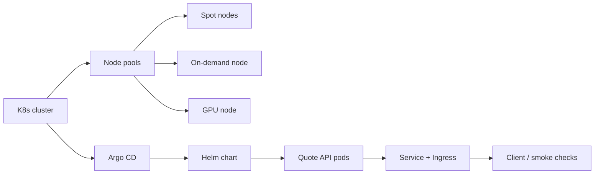

# Quote API Platform Stack

This repository contains the core implementation for Parts 1–3 of the assignment: a small quote API service, a Helm-based GitOps deployment path with spot/on-demand placement policy, and a fixed Kubernetes troubleshooting manifest set.

## Quick start

Use the local harness entrypoint expected by the assignment:

```bash
docker compose up -d
./scripts/run-all.sh
```

Once the cluster is up, the main operational steps are:

```bash
./scripts/20-deploy.sh
./scripts/25-reclaim-drill.sh
```

The service is exposed through the ingress path and should answer on the local URL used by the harness.

## Architecture overview



The flow is intentionally simple: the local harness brings up a Kubernetes cluster, Argo CD deploys the app through the Helm chart, and the app is reachable through the ingress layer.

## Script reference

- [scripts/20-deploy.sh](scripts/20-deploy.sh) — installs Argo CD, creates the application namespace, and deploys the quote API via the Argo CD Application manifest.
- [scripts/25-reclaim-drill.sh](scripts/25-reclaim-drill.sh) — drains a spot node, verifies that the service continues to answer, and then uncordons the node.
- [troubleshoot/prepare.sh](troubleshoot/prepare.sh) — prepares the cluster nodes with the labels and taints needed for the troubleshooting scenario.
- [troubleshoot/verify.sh](troubleshoot/verify.sh) — validates that the fixed troubleshooting manifests satisfy the required behavior.

## Part 1: service implementation

The application is a small Flask API with:

- `GET /healthz` for liveness
- `GET /readyz` for readiness
- `GET /metrics` for Prometheus-compatible metrics
- `GET /api/quote` for a random quote with a short CPU burn to make the endpoint meaningful under load

The container image is built from a multi-stage Dockerfile and runs as a non-root user, which keeps the runtime image smaller and more secure.

## Part 2: GitOps and placement policy

The deployment is driven through a Helm chart in [charts/quote-api](charts/quote-api) and an Argo CD Application manifest in [scripts/quote-api-argo-app.yaml](scripts/quote-api-argo-app.yaml).

Key design choices:

- Node affinity prefers spot nodes to reduce cost.
- A soft on-demand requirement keeps at least one replica anchored to the availability node.
- Topology spread helps distribute replicas across the available nodes without over-constraining rescheduling.
- Probes, requests, limits, HPA, and a PodDisruptionBudget are all included in the chart so the service remains resilient during node churn.

## Part 3: troubleshooting and remediation

The troubleshooting workflow is documented in [TROUBLESHOOTING.md](TROUBLESHOOTING.md). The fixed manifest is committed as [troubleshoot/fixed-app.yaml](troubleshoot/fixed-app.yaml).

The important fixes covered there include:

- restoring minimal NetworkPolicy allow rules while keeping the default-deny policy intact,
- correcting the web container image and probe port configuration,
- aligning resource requests and limits with node capacity,
- fixing the ConfigMap mount reference,
- correcting the Service selector so it targets the correct pods,
- and making the GPU inference deployment match the node label and taint requirements.

## Design decisions and trade-offs

- Chose Flask for the API because it is lightweight and easy to containerize for the assignment workload.
- Kept the CPU burn on the quote endpoint intentionally small but measurable so it can be used in load tests without making the app unrealistic.
- Used Affinity + topology spread instead of hard pinning so the deployment remains resilient when a node is reclaimed or drained.
- Kept the NetworkPolicy least-privilege rather than removing it, because the assignment explicitly requires preserving default-deny behavior.
- Documented the remediation rather than silently changing production behavior, so the troubleshooting path is reproducible.

## Troubleshooting notes

- If the app is not reachable locally, verify that the ingress controller is up and that the local host name resolves as expected.
- If Pods stay Pending, inspect node capacity and resource requests; the memory request and limit in the chart are intentionally conservative for the local cluster.
- If the web workload reports unhealthy, inspect the pod events and the Service endpoints first, because probe and selector issues often look like application failures when they are really wiring problems.
